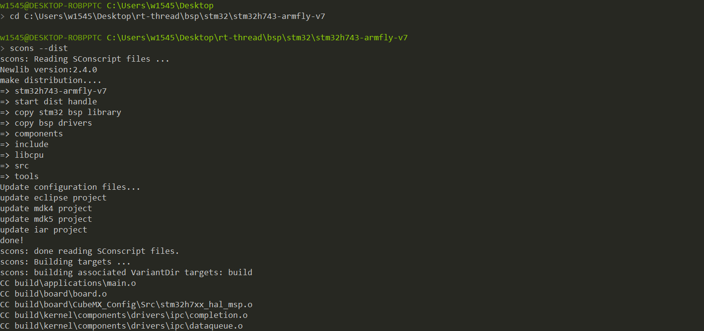
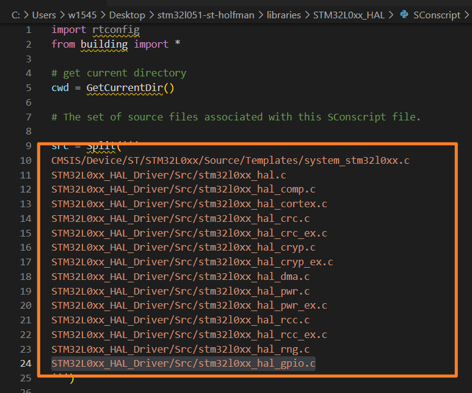
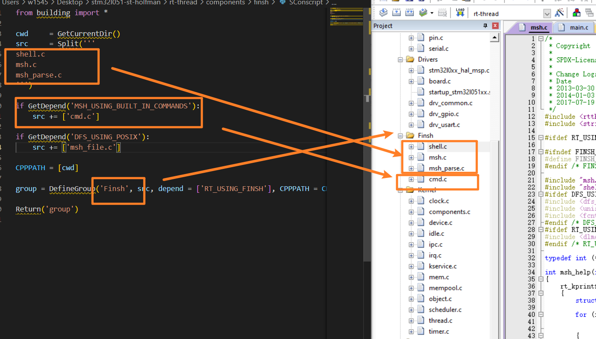
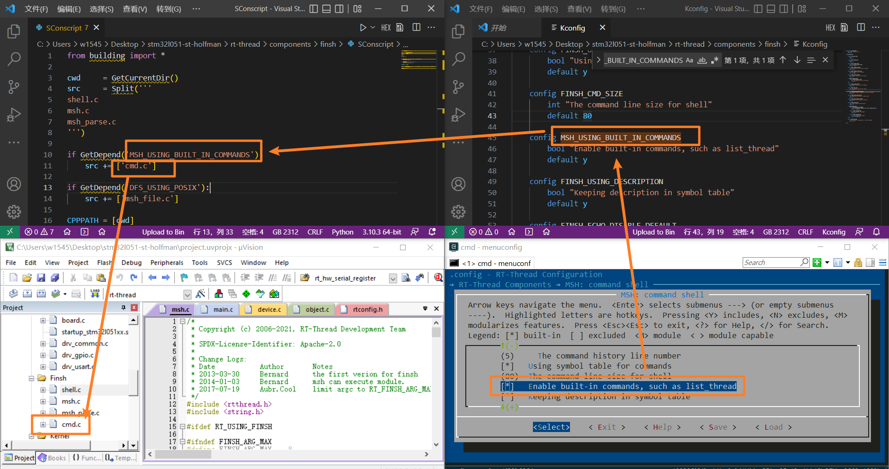

> 本文所述内容，基于STM32HAL库+MDK5+ENV环境搭建，开发平台为Win10和Win11。限于笔者能力，肯定会有疏漏乃至错谬之处，各位看官不吝指正。

# 1. 如何单独生成一个工程

`rt-thread`源码可以从官网的github处获取，下载好之后，在 `bsp` 文件夹下有各式各样的板子的工程。

直接用其开发未免过于冗杂，有很多不需要的文件也被包含进来。

这里 以`stm32h743-armfly-v7`工程为例，简述如何生成单独的工程。

首先，在 `rt-thread`所在文件夹内 打开 `env` ，输入:

```env
cd rt-thread\bsp\stm32\stm32h743-armfly-v7
```

再输入:

```env
scons --dist
```

构建过程入下图所示:



构建完成之后，在对应路径下会生成一个dist文件夹，文件夹里面就是单独的工程文件了。

接下来的操作，若无特殊说明，默认在此文件内操作。


# 2. 如何生成MDK5文件

```env
scons --target=mdk5
```

等待`scons`构建工程之后，打开`project.uvprojx`即可。

# 3. 如何为HAL库添加新的.C文件

> 这个问题由我在移植`armfly-V7`开发板PIN设备时产生，因为这款开发板的一些GPIO口是使用挂载在FMC总线上74HC574扩展而成，为了驱动这些IO口，需要引入hal库的.c文件。如果直接添加，重新生成MDK5文件后这些文件将不会被scons添加进工程。

以我手头一块 `stm32L051` 的板子为例，其它板卡也是同理。

进入对应的HAL库文件夹下,对应目录如下:

```dir
.\libraries\STM32L0xx_HAL
```

打开 `Sconscript` 文件



在这里按照其格式添加想要包含的hal库.c文件。再重新生成MDK5工程并将`stm32l0xx_hal_conf.h`里的宏定义打开即可。

# 4. Sconscript文件分析

这部分内容我是参考[rtt的官方文档](https://www.rt-thread.org/document/site/#/development-tools/build-config-system/SCons)的第4节和第5节。

每个存放.c的文件夹内都要放一个Sconscript。Scons会通过这个文件去构建工程。

官方文档第5节中有一个详细的例子，如下：

```sconscript
# 导入RT-Thread的自定义构建函数，几乎每一个RT-Thread的Sconscript都需要这么做。
# 只有导入了building模块，才可以使用2.2.2介绍的RT-Thread自定义Scons函数
from building import * 

cwd     = GetCurrentDir() # 获取当前脚本的路径
CPPPATH = [cwd] # 将当前路径加入构建搜索的头文件路径
src     = Split('''
shell.c
msh.c
msh_parse.c
''')

#也可以等效成：src = ['shell.c', 'msh.c']

if GetDepend('MSH_USING_BUILT_IN_COMMANDS'): # 判断是否启用MSH的内建命令
    src += ['cmd.c']

if GetDepend('DFS_USING_POSIX'): # 判断是否启用文件系统的POSIX接口
    src += ['msh_file.c']

# 使用DefineGroup创建一个名为Finsh的组
# 该Group是否被添加到工程中，参与编译，取决于depend的宏是否在Kconfig中被使能。
# 即上述的头文件路径和C文件是否被编译，取决于用户在Kconfig中是否使能了RT_USING_FINSH
group = DefineGroup('Finsh', src, depend = ['RT_USING_FINSH'], CPPPATH = CPPPATH) s

Return('group') # 将当前脚本指定的构建对象返回上级SCons脚本

```



可以通过 `GetDepend(某个宏定义)`来通过 `menuconfig`选择如何构建文件，如下图：



在 `menuconfig`中勾选了 `Enable built-in commands,...` 选项，这个选项会打开一个 `MSH_USING_BUILT_IN_COMANDS`的宏定义，然后 `Scons`构建工程的时候，就把`cmd.c`加入编译的选项了。

我们可以通过编辑 `Kconfig`文件，来编辑menuconfig，这是后话。
