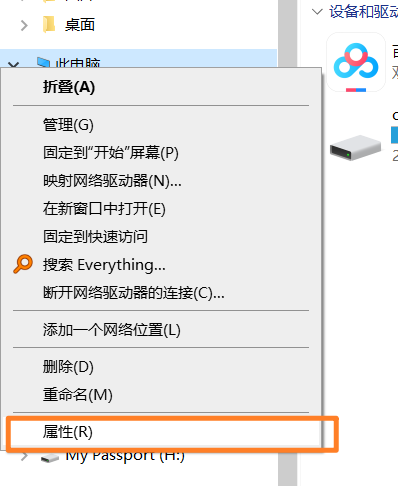
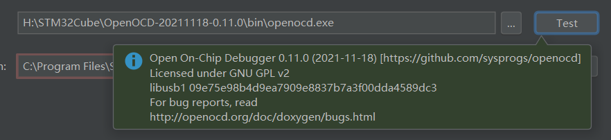

> 本文所述内容，基于STM32HAL库+STM32CubeMX搭建，开发平台为Win10和Win11。限于笔者能力，肯定会有疏漏乃至错谬之处，各位看官不吝指正。
>
> 主要参考了下面两篇教程文档：
>
> https://zhuanlan.zhihu.com/p/145801160
>
> https://www.jetbrains.com/help/clion/embedded-development.html

# 1. window Terminal的安装

> Terminal安装参考链接: https://zhuanlan.zhihu.com/p/351281543

使用`gcc -v`和`arm-none-eabi-gcc -v`检测是否存在编译环境。

根据参考链接，安装好Terminal之后，在桌面右键`open in terminal`打开一个`Window PowerShell` ，键入

```Terminal
gcc -v
```

```Terminal
arm-none-eabi-gcc -v
```

如果当前环境已经存在`gcc`和`arm-none-eabi-gcc`的开发环境，则可以看到它们的安装路径。


如果没有，则去安装`MinGW`和`arm-none-eabi-gcc`并把相关环境添加到`环境变量`里。

# 2.安装MinGW和arm-none-eabi-gcc

> 这部分参考https://zhuanlan.zhihu.com/p/145801160里的方式，安装并且把相关环境变量添加到环境里。
>
> 我这里也赘述一下。

## 2.1 MinGW的安装及配置

### 下载MINGW

打开这个链接https://osdn.net/projects/mingw/releases/，点击下面这个按钮下载Mingw设置工具。


安装方式为一路next，不需要更改配置，默认路径直接安装在C盘里，如果要个更改安装路径，注意安装进目录不要有空格。

在`Basic Setup`界面，左键单击小方框，再勾选 `Mark for installstion`。把`Basic Setup`里的选项都勾上。


然后点击`installation - Update Catalogue`，在弹出的界面中点击 `Review Change`，再点击 `Apply`。

### 编辑环境变量

win10系统下为如下方式，win11同理。

`右键我的电脑-属性`在`设置`界面里输入`环境变量`，选择`编辑系统环境变量`




单击`环境变量`，双击`Path`，


点击`新建`，然后把`gcc.exe`的位置添加进去


## 2.2 安装arm-none-eabi-gcc

> 注意安装路径不要有空格、中文等

打开https://developer.arm.com/downloads/-/gnu-rm，把窗口往下拉，找到这个，我们下载.exe的安装包。


下载完成后，安装它，一路next,安装完成之后勾选`Add path to enviroment varibale`

# 3. CLion相关配置

## 3.1生成CubeMX并添加

使用`STM32CubeMX`新建一个工程，注意工程名字路径中不要带 `()`。如果找不到Cmke Moudle，可能是你工程名字中带了括号的原因。

在IDE选项里，选择 `STM32CubeIDE`。其他的配置就和平时大家玩CubeMX一样，没有什么特殊的地方。


 

打开`CLion`，选择`File-Open`


然后选择`.ioc`文件，它会弹出提示，选择`open as Project`，然后信任这个文件夹。

然后该工程就会被添加到工作区。

## 3.2 配置编译器并build工程

在界面的右上角点击`设置`


在`Build Execution ...`里选择`Toolchains`,点击`+`号，增加一个新的环境，命名为`MinGW-STM32`，然后在`Toolset`里面选择`MinGW`的路径，`C Compiler 和 C++ Compiler`选择你下载的`arm-none-eabi-gcc.exe`的路径。

都选择好之后，点击下方的`cmake` ，再点击 `Reload`按钮。


如果一切配置没有问题，那么会提示构建成功。

这时候上方的 `Build`按钮已经可以使用了。


点击这个小锤子。


会提示编译成功，生成了elf文件。

## 3.3配置OpenOCD并单步调试

下载Open OCD https://gnutoolchains.com/arm-eabi/openocd/，解压到你喜欢的目录。

点击右上角齿轮图标进入`Settings`，点击`Embedded..`，把你的`Open OCD`的路径填入。


点击测试，如果没问题，会出现以下界面。



点击`Edit Configurations`，新建一个OpenOCD配置文件.


在你的工程目录下，新建一个 `.config`文件夹，里面放入一个OpenOCD的配置文件，笔者这里用的是Dap-Link，所以这个`.cfg`文件命名为`daplink.cfg`。实际上这个叫什么都是无所谓的。


在`Board config file` 里，把这个配置文件的路径填入。


现在的关键就是`.cfg`文件里面如何填写，如果是和笔者一样的`dap-link`如下方式填写，然后修改flash_size大小和下载速度即可。

```cfg
#选择下载器类型为DAPLINK
adapter driver cmsis-dap
transport select swd

#设置目标工程的FLASH大小
set FLASH_SIZE 0x20000

source [find target/stm32l0.cfg]

#下载速度10M
adapter speed 10000
```

在 `scripts`文件夹下 `board`是一些开发板的cfg文件，`interface`是不同的编译器，`target`是目标芯片。


stlink可以参考官方的开发板配置，因为官方的板子用的也是st-link，笔者手头上没有别的下载器，并且对这个语法不是很熟悉，就不再鼓捣了。

下图为`board`文件下的各种开发板配置。


下图为`interface`文件夹下的各个下载器配置


下图为`target`文件下的各种目标芯片配置。


# 4.最后效果图


# 5.其他配置

## 5.1 插件

**中文语言包**

目前还是没有中文，只能用汉化的插件，但是..这个翻译就仁者见仁，智者见智了..


# 6我的其他疑问

## 1.能否动态观察变量？

## 2.怎么配置分散加载文件？
